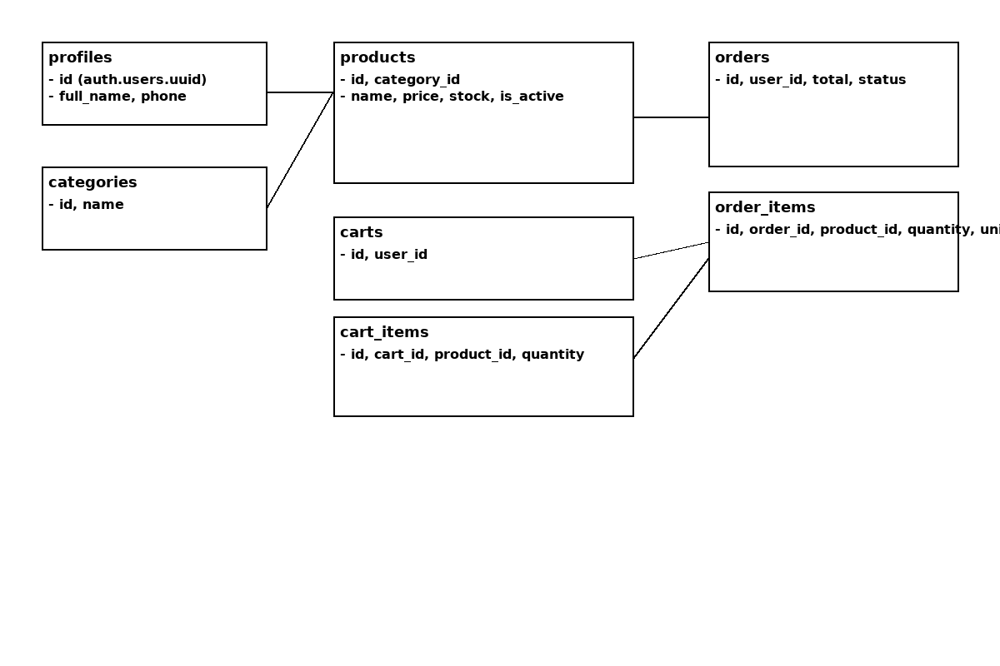

ERD simple diagram: see erd.png. Adapt diagram with diagrams.net or draw.io for submission.
# 📊 Diagrama Entidad-Relación (ERD)

Este documento describe las relaciones clave en la base de datos de la tienda.

 

### Lógica de Relaciones

1.  **Autenticación y Perfiles (`auth.users` y `public.profiles`):**
    * La tabla `profiles` tiene una relación **uno a uno** con `auth.users` usando el `id` (UUID) como llave primaria y foránea.
    * `profiles` almacena el `role` ('user' o 'admin'), que es la base de la seguridad RLS.

2.  **Productos y Categorías:**
    * Un `product` pertenece a una `category` (relación `category_id`).
    * Una `category` puede tener muchos `products`.

3.  **Flujo del Carrito (Cart):**
    * Un `profile` (usuario) tiene **un** `cart` (relación `user_id`, marcada como `UNIQUE`).
    * Un `cart` puede tener muchos `cart_items`.
    * Un `product` puede estar en muchos `cart_items`.
    * La tabla `cart_items` es la tabla intermedia que almacena la cantidad.

4.  **Flujo de Pedidos (Orders):**
    * Un `profile` (usuario) puede tener muchos `orders`.
    * Un `order` puede tener muchos `order_items`.
    * Un `product` puede estar en muchos `order_items`.
    * Los datos del carrito (`cart_items`) se **copian** a `order_items` durante el pago (checkout), guardando el `price_at_purchase` (precio al momento de la compra) para mantener la integridad histórica del pedido.